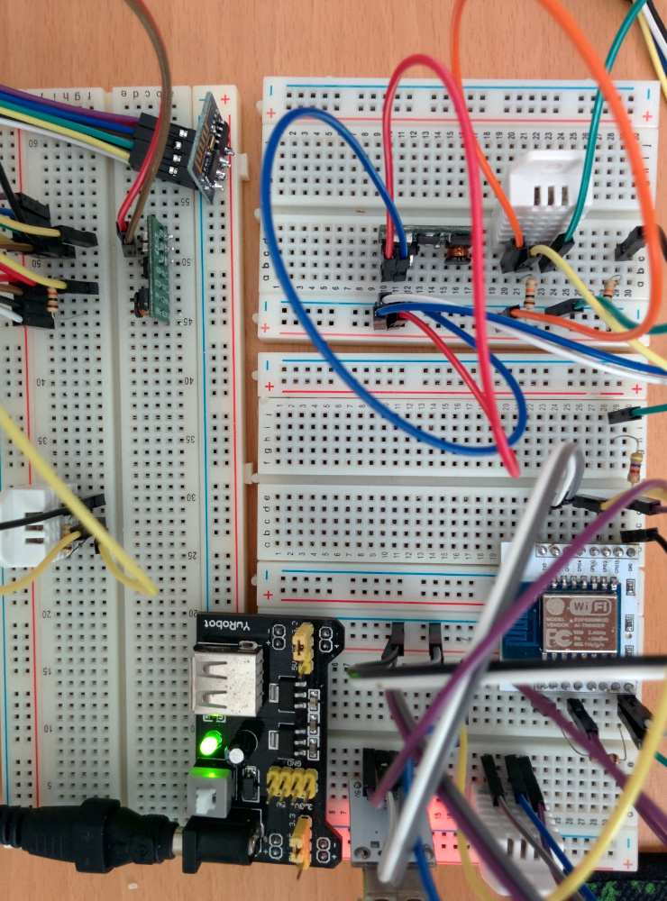
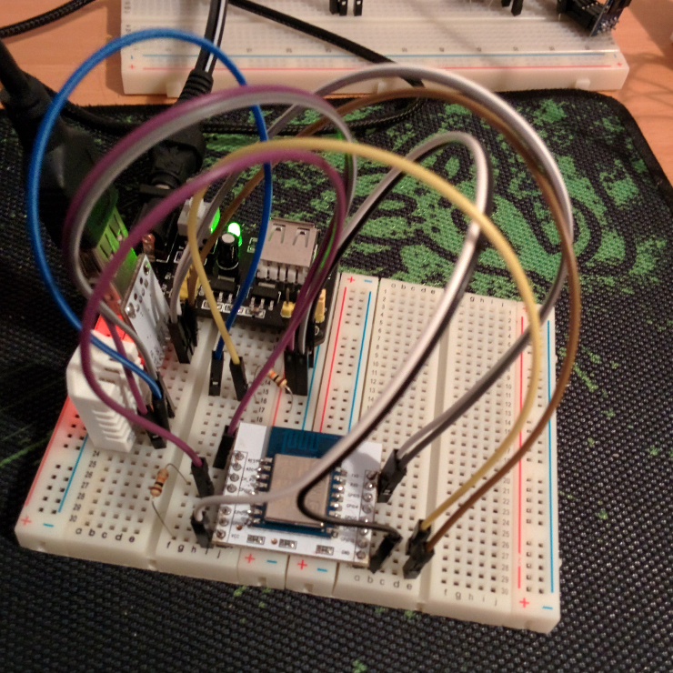

# ESP8266 DHT22 Deepsleep
ESP8266 Lua script running on NodeMCU firmware which sends DHT22 data to web server with deepsleep mode.

## DHT22 Module
From [javieryanez/nodemcu-modules](https://github.com/javieryanez/nodemcu-modules/tree/master/dht22).

## Web server
This script was originally made for [Temp Monitor](https://github.com/ssimunic/Temp-Monitor). You can easily customize it for your project.

## Preview

